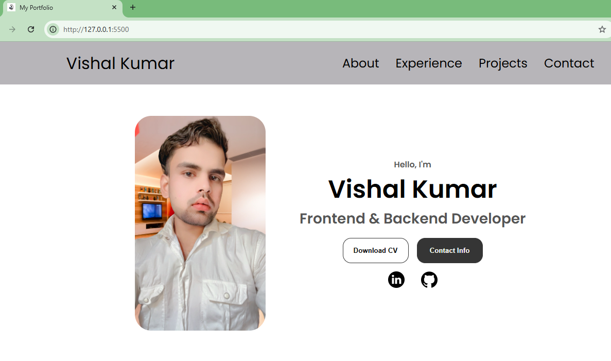

# Personal Portfolio Website  

## Overview  

✍This project is a fully responsive personal portfolio website built to showcase professional experience, skills, and projects. It is designed with clean layout principles, a modern look, and smooth interactions. The goal of this site is to present a developer’s profile, provide quick access to resume and contact information, and highlight past work in an elegant way.
 

## 🌐 Demo

Check out the live demo here 👉: [Portfolio]()

## Key Features  

### 1. Responsive Navigation  
- **Desktop Navigation**: A traditional top navigation bar with links to different sections (About, Experience, Projects, Contact).  
- **Hamburger Menu**: A mobile-friendly hamburger menu that expands into vertical links when viewed on smaller screens. The toggle is controlled with a simple JavaScript function for smooth user experience.  

### 2. Profile Section  
- A dedicated introduction area with a profile image, a professional tagline, and two call-to-action buttons: one for downloading the resume and another for quick navigation to contact details.  
- Social media icons for LinkedIn and GitHub are included, making it easy for visitors to connect.  

### 3. About Section  
- Contains a profile image, experience highlights, and education background.  
- Includes a descriptive text area where a short biography or personal introduction can be displayed.  
- Designed with flexible containers for easy scaling on different devices.  

### 4. Experience Section  
- Organized into categories to present technical skills.  
- Each skill is represented with an icon, skill name, and proficiency level.  
- Skills are grouped into containers to ensure clean organization and readability.  

### 5. Projects Section  
- Highlights recent projects with images, titles, and two action buttons: one linking to the project’s GitHub repository and the other to a live demo.  
- Uses card-like containers with subtle background colors and spacing to visually separate each project.  

### 6. Contact Section  
- Provides quick access to email and LinkedIn contact details.  
- Designed with a simple card layout for clarity and ease of interaction.  

### 7. Footer  
- Contains a duplicate navigation menu for quick scrolling to sections.  
- Displays copyright information.  

## Design and Styling  

- **Typography**: A modern sans-serif font is used for clarity and professionalism.  
- **Color Palette**: Subtle greys and black for text and borders, with white backgrounds to keep a clean and minimal aesthetic.  
- **Layout**: Sections are vertically stacked, with consistent spacing and alignment. Containers use rounded corners and soft borders for a polished look.  
- **Buttons**: Rounded buttons with hover effects that invert colors, adding interactivity and visual feedback.  
- **Icons**: Custom icons are used for skills, social media, and contact information to improve user experience.  

## Responsiveness  

The site is optimized for multiple screen sizes using **media queries**:  

- **Large Screens (1400px and below)**: Adjusts section heights and enables flexible wrapping in layout containers.  
- **Medium Screens (1200px and below)**: Switches from desktop navigation to hamburger menu. Section layouts are adjusted to stack vertically instead of side-by-side.  
- **Small Screens (600px and below)**: Further scales down typography and icons, adjusts section heights, and makes layouts fully vertical for mobile friendliness. Navigation links and buttons are restructured for touch usability.  

## Interactivity  

- A JavaScript toggle function enables the hamburger menu to expand and collapse.  
- Buttons and links are interactive with hover effects.  
- Smooth scrolling is enabled for in-page navigation.  

## Use Cases  

- A personal branding website for students, developers, or professionals looking to showcase their portfolio.  
- Can be extended with more project cards, blog sections, or additional pages.  
- Serves as a lightweight, easy-to-maintain online resume and portfolio.  

## Future Enhancements  

- Adding animations for section transitions.  
- Integrating a contact form with backend support (e.g., using email API).  
- Expanding the Projects section with more detailed descriptions.  
- Optimizing accessibility features like ARIA labels and keyboard navigation.  

## 📸 View of My Personal Portfolio

- **Portfolio rofile**
  